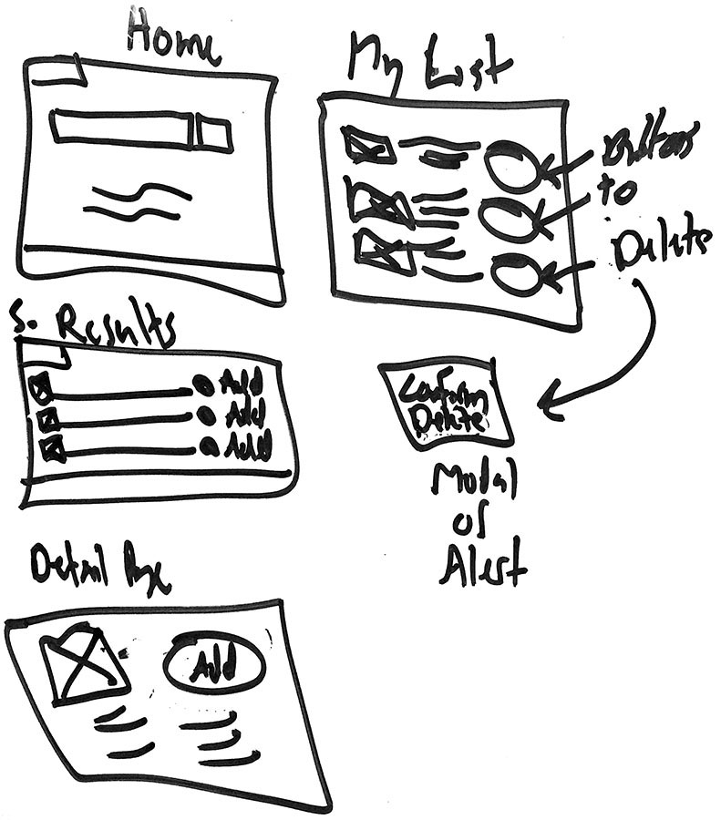
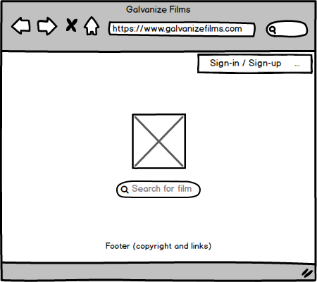

# Galvanize Films

## Student Exercise

See it on the web at:    
https://gfilms.firebaseapp.com

## Wireframes





## API (via Kyle)

Endpoint:
https://mighty-eyrie-15280.herokuapp.com/films

if you make a POST request to that endpoint with an object that looks like:

 ```{
    title: "Ghost",
    genre: "Good",
    description: "Uh",
    coverPicture: "https://www.google.com",
    rating: "R"
}
```

You'll get a positive response.

Everything else will get a `400 Bad Request`
